# Entangld
Here's how to design military command protocols using your quantum qubit system, with actionable diagrams and implementation specifics:

---

### **1. Nuclear Command & Control Protocol**
**Quantum Advantage**: Tamper-proof launch authorization via GHZ-entangled decision nodes.

#### **Protocol Diagram**

```mermaid
sequenceDiagram
    participant President
    participant Silo1 as Silo (Qubit 1)
    participant Silo2 as Silo (Qubit 2)
    participant Silo3 as Silo (Qubit 3)
    
    President->>+Silo1: Initiate Launch (H Gate)
    Silo1->>+Silo2: Entangle (formGHZGroup)
    Silo1->>+Silo3: Entangle (formGHZGroup)
    President->>Silo1: Measure (X Gate → Collapse)
    Silo1->>Silo2: Propagate Measurement
    Silo2->>Silo3: Propagate Measurement
    Note over Silo1,Silo3: All qubits now show |1> or |0><br>Consensus achieved
```


#### **Implementation Steps**
1. **Hardware Setup**:
   ```cpp
   // Each nuclear silo gets a Qubit instance
   Qubit president_node("nuclear_cmd", 0xDEFCON);
   Qubit silo1("silo_alpha", 0xDEFCON);
   Qubit silo2("silo_bravo", 0xDEFCON);
   ```

2. **Authorization Protocol**:
   ```cpp
   // Form GHZ state (requires all 3 nodes)
   std::vector<Qubit*> launch_nodes = {&president_node, &silo1, &silo2};
   formGHZGroup(launch_nodes);

   // President applies X gate to encode launch order
   president_node.applyGate('X'); // |1> = authorize
   ```

3. **Execute Only If Consensus**:
   ```cpp
   if (president_node.measure() == 1 && 
       silo1.getMeasurement() == 1 && 
       silo2.getMeasurement() == 1) {
       launch_missiles(); // Quantum-verified order
   }
   ```

---

### **Deployment Checklist**
1. **Hardware**: 
   - Raspberry Pi 4 clusters (each Pi = 1 qubit node)
   - Radiation-shielded enclosures

2. **Network**: 
   - Point-to-point microwave links (no TCP/IP)
   - 128-bit shared memory encryption

3. **Testing**:
   ```cpp
   // Simulate jamming attacks
   TEST_F(CommsTest, TestEntanglementBreak) {
       Qubit q1("frontline", 0xWAR);
       Qubit q2("hq", 0xWAR);
       q1.entangle({q2.name()});
       mock_jamming_attack(); // Should trigger alarm within decoherence timeout
       ASSERT_TRUE(alarm_triggered);
   }
   ```

Would you like me to develop the exact memory mapping specifications for hardened shared-memory segments? I can provide the `mmap()` flags and encryption layer details needed for MIL-STD-8916 compliance.
